<div align="center">
  
  <br/><br/>

  <h1>SIGNAL</h1>
  <p><em>Only what matters. Delivered by an agent that never sleeps.</em></p>

  <br/>

  `Next.js 14` &nbsp;·&nbsp; `TypeScript` &nbsp;·&nbsp; `USDC on Base` &nbsp;·&nbsp; `x402`

  <br/><br/>

  ---
</div>

<br/>

Signal is an autonomous intelligence agent for crypto projects. Point it at any token — it listens to Twitter, GitHub, Discord, and on-chain activity 24/7, uses AI to filter out the noise, and delivers only the events that actually matter.

No alerts fatigue. No missed alpha. Just signal.

<br/>

---

## ⚡ Infrastructure

<div align="center">

### Everything runs on [Conway](https://conway.tech)

</div>

Conway is the permissionless infrastructure layer that makes Signal possible — it lets AI agents spin up VMs, register domains, and pay for compute **without any human involvement**.

| Conway Service | What Signal uses it for |
|---|---|
| **Conway Cloud** | Linux VM where the agent runs 24/7 |
| **Conway Domains** | Agent registers `getsignal.xyz` autonomously |
| **Conway Compute** | AI inference to score event relevance |
| **x402 Protocol** | USDC micropayments on Base — no KYC, no login |

The agent pays its own Conway bills with subscription revenue. Fully self-sustaining.

→ [conway.tech](https://conway.tech) · [docs.conway.tech](https://docs.conway.tech) · [npm: conway-terminal](https://npmjs.com/package/conway-terminal)

<br/>

---

## what it does

```
you add a project
  → agent wakes up on Conway Cloud
  → scans Twitter, on-chain, GitHub, news every 5 min
  → Conway Compute scores each event for relevance
  → low score? dropped. high score? delivered.
  → you get only the signal, never the noise
```

**Sources monitored:**
- 🐦 Twitter — dev posts, influencer mentions, FUD detection
- ⛓️ On-chain — whale moves, LP changes, contract interactions
- 🐙 GitHub — commit activity, new deployments, security patches
- 📰 News — aggregated from 40+ crypto news sources

<br/>

---

## getting started

**Prerequisites:** Node.js 18+, Claude Code, USDC on Base (~$5 to bootstrap)

```bash
# 1. clone
git clone https://github.com/yourusername/signal.git && cd signal

# 2. install
npm install

# 3. setup Conway — generates agent wallet + API key automatically
npm install -g conway-terminal
npx conway-terminal
# wallet → ~/.conway/wallet.json
# api key → ~/.conway/config.json

# 4. configure
cp .env.example .env.local
# add your CONWAY_API_KEY from ~/.conway/config.json

# 5. run
npm run dev
```

<br/>

---

## API

#### `POST /api/subscribe` — start monitoring a project

Requires **0.05 USDC per project** via x402 on Base.

```ts
// request
{
  walletAddress: "0x...",
  projects: [
    { name: "Arbitrum", symbol: "ARB", twitter: "arbitrum", chain: "arbitrum" }
  ]
}

// response
{
  success: true,
  subscription: { paidUntil: "2025-09-18", amount: 0.05 },
  agent: { status: "spawning", conwayVm: "vm_signal_prod" }
}
```

#### `GET /api/feed?wallet=0x...` — get your signal feed

```ts
// response
{
  events: [
    {
      source: "onchain",
      severity: "critical",
      title: "Whale moved $2.1M out of Uniswap LP",
      aiScore: 94,
      timestamp: "..."
    }
  ],
  agentStatus: { running: true, lastScan: "..." }
}
```

<br/>

---

## project structure

```
signal/
├── src/
│   ├── app/
│   │   ├── api/
│   │   │   ├── feed/route.ts         ← signal feed endpoint
│   │   │   ├── subscribe/route.ts    ← x402 gated subscription
│   │   │   └── projects/route.ts     ← manage watched projects
│   │   └── dashboard/
│   ├── lib/
│   │   ├── conway.ts                 ← Conway Cloud / Compute / Domains
│   │   ├── agent.ts                  ← core scanning + scoring agent
│   │   └── x402.ts                   ← USDC payment middleware
│   └── types/index.ts
├── public/logo.svg
└── .env.example
```

<br/>

---

## economics

```
0.05 USDC / project / month
         ↓
  breaks even at ~120 projects
         ↓
  revenue → pays Conway Cloud VM ($5/mo)
          → pays Conway domain renewal
          → pays Conway Compute inference
         ↓
  agent stays alive indefinitely
```

No company. No employees. Just an agent that earns what it spends.

<br/>

---

## roadmap

- [x] Multi-source event scanning
- [x] AI relevance scoring via Conway Compute
- [x] x402 USDC subscriptions
- [x] Conway Cloud autonomous deployment
- [ ] Telegram / Discord delivery
- [ ] Custom alert thresholds per project
- [ ] On-chain subscription registry
- [ ] Agent spawns sub-agents per project for parallelism
- [ ] Public signal leaderboard — most active projects

<br/>

---

## license

MIT

<br/>

---

<div align="center">
  <sub>Powered by <a href="https://conway.tech">Conway</a> — permissionless infrastructure for autonomous agents.</sub>
</div>
